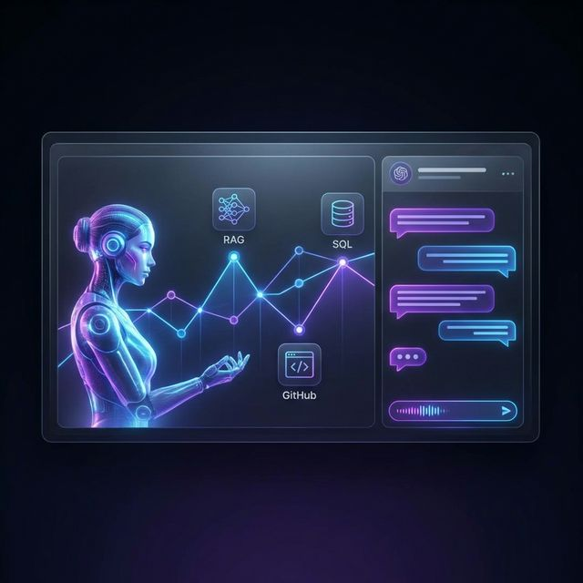

# RH Insight AI - Assistant de Recrutement Intelligent



Plateforme d'analyse et d'interaction avec les données de recrutement utilisant l'intelligence artificielle générative. Ce projet combine le traitement de documents (RAG), les requêtes structurées (SQL) et l'analyse de projets open-source (GitHub) pour offrir une vue complète sur un profil de candidat.

## Présentation du Projet

RH Insight AI est un assistant conçu pour faciliter le travail des recruteurs et des gestionnaires de talents. Il permet d'interroger à la fois le contenu textuel des CV (expériences, compétences, formations) et les données structurées (statuts, dates, informations de contact) ainsi que l'activité technique sur GitHub à travers une interface naturelle et fluide.

### Fonctionnalités Clés

- **Analyse de documents (RAG)** : Recherche sémantique et extraction d'informations directement depuis les fichiers PDF des CV.
- **Requêtes de données (SQL)** : Analyse statistique et recherche de critères précis dans la base de données des candidats.
- **Agent GitHub** : Récupération et analyse en temps réel des dépôts (publics et privés), langages et descriptions de projets.
- **Orchestration Multi-Agents** : Utilisation de LangGraph pour router les questions vers l'agent le plus pertinent avec un flux hybride séquentiel (SQL -> RAG -> GitHub).
- **Interface Premium** : Design "Purple Theme" moderne avec badges de sources et effets de flou (glassmorphism).
- **Interaction vocale** : Support de la synthèse vocale masculine française haute qualité (`edge-tts`) et de la reconnaissance vocale.

## Architecture Technique

Le projet repose sur une architecture multi-agents moderne :

- **Moteur d'exécution** : Python 3.13+
- **Framework IA** : LangChain et LangGraph
- **Modèles de langage** : DeepSeek R1 (via Ollama)
- **Base de données Vectorielle** : Chroma (Vector Database)
- **Base de données Relationnelle** : SQLite avec validation SQL security
- **API Externes** : GitHub REST API avec caching
- **Frontend** : Streamlit avec personnalisation CSS avancée

## Guide d'Installation

### Prérequis

- Python 3.10 ou supérieur
- Ollama (configuré avec le modèle deepseek-r1)

### Mise en place de l'environnement

1. **Cloner le projet**

   ```bash
   git clone <url-du-repo>
   cd RH_insight-AI
   ```

2. **Créer l'environnement virtuel**

   ```bash
   python3 -m venv venv
   source venv/bin/activate
   ```

3. **Installer les dépendances**

   ```bash
   pip install -r requirements.txt
   ```

4. **Configuration**

   ```bash
   cp .env.example .env
   # Modifiez le fichier .env pour y ajouter vos clés API si nécessaire
   ```

### Initialisation des données

Pour que l'assistant soit opérationnel, vous devez initialiser les bases de données :

```bash
# Initialiser la base SQL et insérer des données de test
python scripts/init_db.py
python scripts/seed_db.py

# Indexer les CV PDF dans la base vectorielle
python scripts/ingest_cv.py
```

## Lancement de l'Application

Lancer le serveur de développement Streamlit :

```bash
streamlit run app/streamlit_app.py
```

Le script `run.sh` est également disponible pour automatiser le lancement dans certains environnements.

## Auteur

Projet développé par Amaury Rammanat
