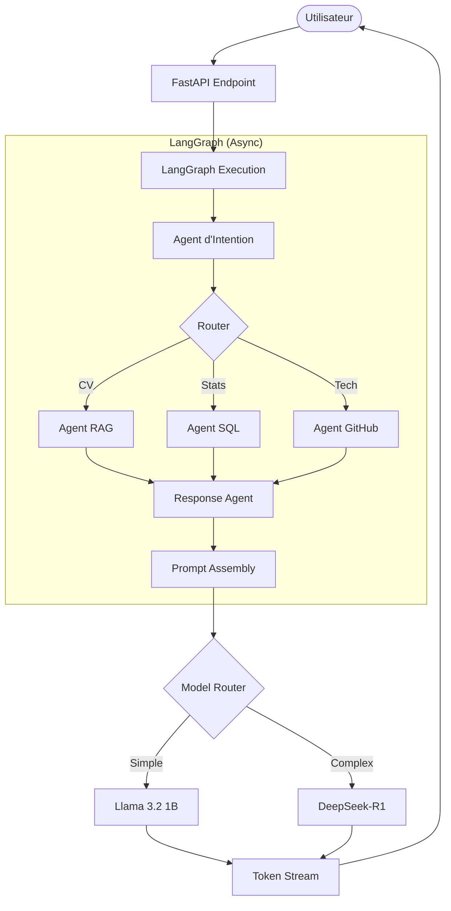

# Architecture de RH Insight AI

Ce document décrit l'architecture technique et le flux de données de la plateforme.

## 1. Vue d'Ensemble

RH Insight AI est une application basée sur une architecture **Multi-Agents** orchestrée par **LangGraph**, optimisée pour la performance et la latence (Étape 5).

## 4. Modèles de Langage (LLMs)

Le projet utilise une stratégie hybride via **Ollama** pour maximiser la performance sur puce Apple Silicon (M4 Pro) :
- **Qwen 3.5 (4B)** : Modèle principal (Standard). Utilisé pour l'intention, le SQL, la synthèse RAG et les réponses standards. Offre un compromis idéal vitesse (30-60 tok/sec) / précision.
- **DeepSeek-R1 (7B)** : Modèle de raisonnement (Reasoning). Utilisé uniquement pour les requêtes hybrides ou complexes nécessitant une analyse approfondie.

### Points clés de l'architecture moderne :
- **Backend Asynchrone** : Utilisation intensive de `FastAPI`, `httpx`, `aiosqlite` et `ainvoke`.
- **Streaming de Tokens** : Réponse en temps réel via `StreamingResponse` pour une expérience premium.
- **Model Routing** : Sélection dynamique du modèle LLM en fonction de la complexité de la tâche.

## 2. Orchestration et Flux (LangGraph)

Le flux de décision est géré par un graphe d'états asynchrone qui assemble le contexte avant la génération finale.

### Diagramme de Flux (Phase d'Inférence)

## 3. Composants Techniques

### Frontend (Vue.js 3)
- **Architecture** : Vue 3 (Composition API) + Pinia + Vue Router.
- **Communication** : API Fetch pour le support natif du streaming de tokens.
- **Sécurité** : JWT stocké dans le state manager avec intercepteurs Axios (pour les appels hors chat).

### Backend (FastAPI Modulaire)
- **Core** : `monitoring.py` pour le profiling de la latence de chaque composant.
- **Agents** : Entièrement refactorisés en `async` pour éviter tout blocage de l'Event Loop.
- **SQL** : `SQLAlchemy 2.0` avec moteur asynchrone `aiosqlite`.
- **RAG** : Recherche vectorielle Chroma optimisée par cache LRU pour les embeddings.

## 4. Stratégie de Latence (Étape 5)

| Composant | Optimisation | Impact |
| :--- | :--- | :--- |
| LLM | Model Routing (Llama vs DeepSeek) | -50% latence sur questions simples |
| I/O | Async complet (SQL, GitHub, RAG) | Fluidité totale de l'Event Loop |
| UX | Streaming de Tokens | Perception de réponse instantanée |
| Data | Cache LRU (Embeddings) | -300ms par recherche RAG |
