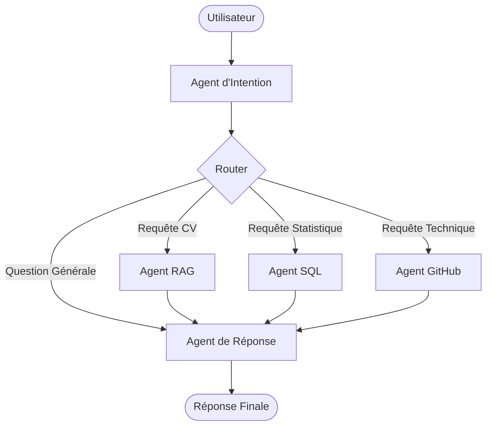

# Architecture de RH Insight AI

Ce document décrit l'architecture technique et le flux de données de la plateforme.

## 1. Vue d'Ensemble

RH Insight AI est une application basée sur une architecture **Multi-Agents** orchestrée par **LangGraph**. Elle permet de traiter des requêtes complexes en combinant plusieurs sources de données :
- **SQL** : Données structurées des candidats (SQLite).
- **RAG** : Données textuelles extraites des CV (ChromaDB + PDF).
- **GitHub** : Données techniques en temps réel via l'API GitHub.

## 2. Orchestration (LangGraph)

Le flux de décision est géré par un graphe d'états qui route la requête utilisateur vers l'agent approprié.

### Diagramme de Flux

## 3. Composants Techniques

### Frontend (Vue.js)
- Application Single Page (SPA) multipages : Onboarding, Authentification, Dashboard.
- Framework : Vue.js 3 + Vite + Vue Router.
- State Management : Pinia.
- Design System : "AI Premium Workspace" (TailwindCSS v4, Dark Navy, Cobalt Blue, Glassmorphism).

### Backend (FastAPI / Modules)
- **app/agents** : Logique métier de chaque agent spécialisé.
- **app/rag** : Gestion de l'indexation et de la recherche vectorielle.
- **app/llm** : Client Ollama pour l'interaction avec les modèles locaux.
- **app/sql** : Gestion des interactions avec la base SQLite.

### Stockage
- **ChromaDB** : Base de données vectorielle pour le stockage des embeddings de CV.
- **SQLite** : Base de données relationnelle pour les métadonnées candidats.

## 4. Modèles de Langage (LLMs)

Le projet utilise actuellement des modèles locaux via **Ollama** :
- **DeepSeek-R1 (7B)** : Utilisé pour le raisonnement complexe et la génération finale.
- **Llama 3.2 (1B)** : Utilisé pour des tâches rapides comme la classification d'intention ou la génération de requêtes SQL.
