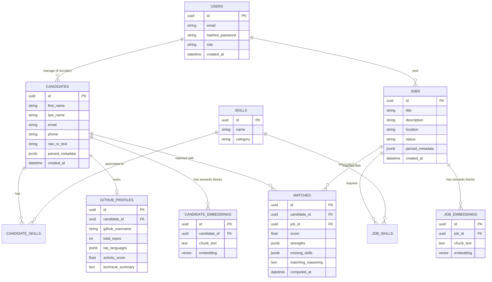

# RH Insight AI — Conception de la Base de Données

Ce document définit l'architecture de la base de données PostgreSQL augmentée par l'extension `pgvector` pour RH Insight AI. Cette architecture est conçue pour supporter les agents LangGraph (CV, Job, Matching, GitHub, Analytics) de la vision cible.

---

## 1. Diagramme des Entités Métier



---

## 2. Tables SQL Détaillées et Relations

Toutes les tables utiliseront des UUID comme clés primaires pour des raisons de sécurité et de scalabilité.

### A. Utilisateurs et Profils de Base
* **`users`** : Stocke les recruteurs/administrateurs du système.
* **`candidates`** : Stocke les informations des candidats. La colonne `parsed_metadata` (JSONB) accueillera les données structurées extraites par l'Agent CV (expériences, formations structurées).
* **`jobs`** : Stocke les offres d'emploi. `parsed_metadata` accueillera les attentes structurées (salaire, télétravail).

### B. Gestion des Compétences (Skills Mapping)
Une approche normalisée est adoptée pour croiser les profils et les offres :
* **`skills`** : Dictionnaire unique des compétences (ex: Python, Docker, Management).
* **`candidate_skills`** : Table de jointure entre un candidat et ses compétences, avec potentiellement un champ `years_of_experience` ou `confidence_score` (évalué par l'IA).
* **`job_skills`** : Table de jointure entre une offre et les compétences requises, avec un champ `is_mandatory` (booléen).

### C. Enrichissement (Agent GitHub)
* **`github_profiles`** : Stocke les analyses de l'Agent GitHub (langages principaux, activité) permettant d'enrichir le profil d'un développeur sans avoir à repasser par l'API GitHub à chaque requête.

---

## 3. Modèle de Stockage des Vecteurs (pgvector)

Plutôt que d'avoir un seul vecteur global pour un CV (ce qui dilue la sémantique), nous stockons des "chunks" (blocs sémantiques) par candidat et par offre.

### Table `candidate_embeddings`
```sql
CREATE TABLE candidate_embeddings (
    id UUID PRIMARY KEY,
    candidate_id UUID REFERENCES candidates(id) ON DELETE CASCADE,
    chunk_type VARCHAR(50), -- ex: 'experience', 'education', 'summary'
    chunk_text TEXT NOT NULL,
    embedding VECTOR(768) -- Dimension de nomic-embed-text
);
```

### Table `job_embeddings`
```sql
CREATE TABLE job_embeddings (
    id UUID PRIMARY KEY,
    job_id UUID REFERENCES jobs(id) ON DELETE CASCADE,
    chunk_type VARCHAR(50), -- ex: 'requirements', 'benefits'
    chunk_text TEXT NOT NULL,
    embedding VECTOR(768)
);
```

---

## 4. Stratégie d'Indexation HNSW

Pour garantir des performances optimales lors des recherches RAG en langage naturel sur un large volume de candidats, nous utiliserons un index **HNSW (Hierarchical Navigable Small World)** fourni par pgvector.

L'indexation sera basée sur la similarité cosinus (`vector_cosine_ops`), qui est recommandée pour les embeddings textuels générés par des modèles LLM.

```sql
-- Création de l'index HNSW pour les candidats
CREATE INDEX idx_candidate_embeddings_hnsw 
ON candidate_embeddings 
USING hnsw (embedding vector_cosine_ops)
WITH (m = 16, ef_construction = 64);

-- Création de l'index HNSW pour les offres
CREATE INDEX idx_job_embeddings_hnsw 
ON job_embeddings 
USING hnsw (embedding vector_cosine_ops)
WITH (m = 16, ef_construction = 64);
```
*(Les paramètres `m` et `ef_construction` pourront être ajustés lors des tests de charge).*

---

## 5. Gestion des Scores de Matching

La table **`matches`** (ou `candidate_job_matches`) agira comme un cache intelligent pour le **Matching Agent**.

Lorsqu'un nouveau CV est importé ou qu'une nouvelle offre est publiée, un processus asynchrone (Agent) calcule le score d'adéquation et le stocke ici.

```sql
CREATE TABLE matches (
    id UUID PRIMARY KEY,
    candidate_id UUID REFERENCES candidates(id) ON DELETE CASCADE,
    job_id UUID REFERENCES jobs(id) ON DELETE CASCADE,
    score FLOAT NOT NULL, -- de 0 à 100
    strengths JSONB, -- ["Python", "FastAPI"]
    missing_skills JSONB, -- ["Docker"]
    matching_reasoning TEXT, -- L'explication textuelle de l'IA (CoT)
    computed_at TIMESTAMP DEFAULT NOW(),
    UNIQUE(candidate_id, job_id)
);
```
**Avantage** : Lorsqu'un recruteur ouvre une offre, les candidats les plus pertinents s'affichent instantanément grâce à un simple `ORDER BY score DESC`.

---

## 6. Préparation aux Futurs Agents LangGraph

Cette structure est conçue pour alimenter chaque nœud du graphe :
1. **CV Agent** : Lit un PDF, insère dans `candidates`, `candidate_skills` et génère les chunks dans `candidate_embeddings`.
2. **Job Agent** : Fait l'équivalent pour `jobs`, `job_skills`, et `job_embeddings`.
3. **GitHub Agent** : Prend un `candidate_id`, scrappe GitHub, et met à jour `github_profiles`.
4. **Matching Agent** : Requête les tables `candidates` et `jobs`, utilise un LLM pour évaluer l'adéquation, et enregistre dans `matches`.
5. **Analytics Agent** : Effectue des requêtes SQL complexes (Text-to-SQL) sur les tables relationnelles structurées (`skills`, `matches`, `github_profiles`) sans avoir besoin de RAG.

---

## Prochaines Étapes Techniques (Alembic)
1. Ajouter l'extension PostgreSQL : `CREATE EXTENSION IF NOT EXISTS vector;` (doit être la première migration).
2. Créer les modèles SQLAlchemy (Base, Mapped) intégrant `pgvector` (`from pgvector.sqlalchemy import Vector`).
3. Générer les révisions Alembic correspondantes.
