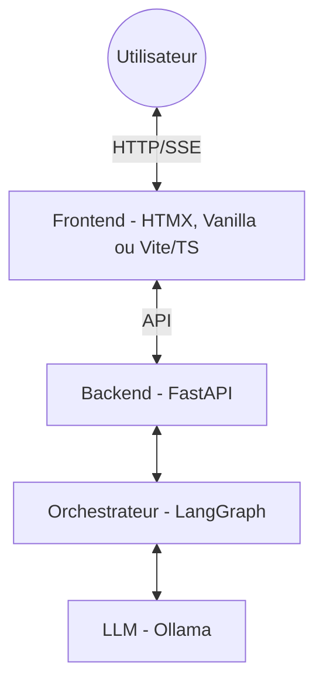

# Plan de Migration : Streamlit vers FastAPI

L'objectif est de transformer l'application monolithique Streamlit en une architecture découplée avec un backend robuste en FastAPI, permettant une meilleure scalabilité et une interface plus moderne.

## Recommandation Personnalisée (Pour vous)

Si vous ne connaissez pas React ni Vite, voici mon analyse pour votre cas :

- **Est-ce une bonne pratique ?** Oui, c'est même du "State of the Art". Utiliser FastAPI pour le calcul lourd (IA/Agents) et du TypeScript/Tailwind pour l'affichage est une architecture professionnelle, propre et très performante.
- **Le meilleur choix pour vous : Option A (HTMX)**. C'est l'approche la plus proche de l'esprit Django/Python. Vous restez sur du HTML que vous connaissez, et HTMX s'occupe de tout le dynamisme. C'est idéal pour apprendre sans se sentir submergé.
- **Le choix "Investissement d'avenir" : Option C (Vite + TS)**. Si vous avez 30 minutes pour apprendre à lancer Vite, c'est l'option qui vous donnera le meilleur bagage technique pour le futur. TypeScript n'est pas "un framework", c'est juste du JavaScript "solide".

## Architecture Cible (Options de Frontend)

Vous pouvez tout à fait utiliser **TypeScript** et **Tailwind** sans React ou Next.js. Voici vos trois options :

### Option A : FastAPI + HTMX (Le plus proche de Python)

- **Concept** : Templates HTML (Jinja2) + HTMX pour le dynamisme.
- **Avantage** : Presque zéro JavaScript. Très rapide à développer.

### Option B : FastAPI + Vanilla JS / Tailwind

- **Concept** : Un simple fichier `index.html` + script JS pur.
- **Avantage** : Aucune étape de compilation. Très léger.

### Option C : FastAPI + TypeScript/Tailwind (Modern Vanilla - Recommandé)

- **Concept** : Utiliser **Vite** comme outil de build pour compiler votre TypeScript et votre Tailwind CSS, mais sans React. Vite génère des fichiers statiques ultra-rapides que FastAPI sert directement.
- **Avantage** : Vous avez la sécurité du typage (TypeScript), la puissance des styles (Tailwind), mais gardez une application légère et performante. C'est l'approche la plus moderne "hors framework".

---

## Étapes de Migration

### 1. Préparation du Backend (FastAPI)

- **Modèles de Données** : Définir les schémas Pydantic pour les requêtes (`ChatRequest`) et les réponses (`ChatResponse`).
- **Endpoints REST** :
  - `POST /chat` : Envoi d'un message.
  - `GET /history/{session_id}` : Récupération de l'historique.
- **Streaming (SSE)** : Adapter la boucle `app.stream()` de LangGraph pour envoyer les events au format Server-Sent Events.

### 2. Gestion de l'État (Session)

- Streamlit gère le `session_state` automatiquement.
- Avec FastAPI, il faudra utiliser un `session_id` et stocker les messages dans la base SQL pour qu'ils persistent.

### 3. Intégration TTS et Médias

- **Recommandation** : Laisser le frontend gérer le TTS (Web Speech API ou Edge-TTS via JS) pour une meilleure réactivité.

---

## Roadmap d'Implémentation

1. **Phase 1 : Structure** - Création de `app/main.py` et configuration Uvicorn.
2. **Phase 2 : Chat API** - Implémentation du routeur `/chat` et du streaming SSE.
3. **Phase 3 : Frontend** - Configuration de Vite avec TypeScript et Tailwind.

---

## Estimation de l'Effort (Option C)

Pour vous donner une idée réaliste du travail pour l'**Option C** :

- **Complexité** : **Moyenne**. Le plus dur est la séparation "cerveau" (Backend) et "visuel" (Frontend). Ce n'est plus un seul fichier qui fait tout.
- **Durée estimée** :
  - **Backend (FastAPI)** : ~1 à 2 heures (votre logique est déjà prête, il faut juste l'exposer).
  - **Frontend (Vite/TS)** : ~2 à 4 heures pour recréer l'interface de chat et le streaming.
- **Courbe d'apprentissage** : Un peu plus raide que Streamlit, mais c'est un investissement rentable pour n'importe quel développeur.

---

## Avantages de FastAPI

- **Asynchrone** : Support natif de `async/await`.
- **Swagger** : Documentation interactive automatique (`/docs`).
- **Flexibilité** : Permet de brancher n'importe quel frontend (même une app mobile plus tard).
